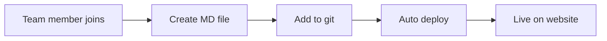

# Ther-AI Website PRD
**Product Requirements Document - New Astro/Bolt Website Development**

## 📋 Project Overview
Build a brand new Ther-AI website using modern technologies (Astro/Bolt) with dynamic content management capabilities inspired by WordPress ACF functionality, but implemented with modern web standards.

## 🎯 Objectives
- **Performance**: Lightning-fast loading with modern web technologies
- **SEO**: Leverage Astro's built-in SEO optimizations
- **Developer Experience**: Modern toolchain and component-based architecture
- **Content Management**: WordPress ACF-inspired dynamic content features

## 🏗️ Technical Architecture

### Core Technologies
- **Frontend Framework**: Astro 4.x
- **Styling**: Tailwind CSS
- **Content Management**: 
  - Astro Content Collections (markdown/MDX)
  - Alternative: Headless CMS (Strapi/Sanity)
- **Deployment**: Vercel/Netlify
- **Database**: (If needed) PostgreSQL + Prisma

### Project Structure
```
├── src/
│   ├── components/
│   │   ├── ui/
│   │   ├── sections/
│   │   └── layout/
│   ├── content/
│   │   ├── team/
│   │   ├── projects/
│   │   └── blog/
│   ├── pages/
│   └── layouts/
```

## 🧑‍💼 Dynamic Content Management

### Team Management
**Requirement**: WordPress ACF-like team member addition/removal

**Solution Options**:
```markdown
# Option 1: Content Collections (Recommended)
src/content/team/john-doe.md
---
name: "Dr. John Doe"
position: "Senior AI Researcher"
department: "Radiology"
bio: "10+ years experience in..."
avatar: "/images/team/john-doe.jpg"
linkedin: "https://linkedin.com/in/johndoe"
email: "john@ther-ai.com"
specialties: ["AI", "Radiology", "Deep Learning"]
active: true
order: 1
---
```

**Features**:
- ✅ Automatic listing on team page
- ✅ SEO-friendly URLs
- ✅ Type-safe content
- ✅ Git-based version control

### Project Management
**Requirement**: Dynamic project portfolio

**Solution**:
```markdown
# src/content/projects/cancer-detection-ai.md
---
title: "AI-Powered Cancer Detection"
description: "Early stage cancer detection using deep learning"
category: "Oncology"
status: "active" | "completed" | "in-progress"
startDate: "2024-01-15"
endDate: "2024-12-31"
technologies: ["TensorFlow", "Python", "DICOM"]
team: ["john-doe", "jane-smith"]
featured: true
images: 
  - "/images/projects/cancer-detection-1.jpg"
  - "/images/projects/cancer-detection-2.jpg"
---
```

## 🎨 UI/UX Requirements

### Design Guidelines
- **Style**: Modern, minimalist, medical-focused
- **Color Palette**: 
  - Primary: Medical blue/white tones
  - Accent: Trust-building green tones
- **Typography**: Professional, readable (Inter/Roboto)
- **Responsiveness**: Mobile-first approach

### Components
```typescript
// Required Components
- Header/Navigation
- Hero Section
- Team Grid
- Project Showcase
- About Section
- Contact Form
- Footer
- Loading States
- Error Boundaries
```

## ⚡ Performance Requirements
- **Core Web Vitals**:
  - LCP < 2.5s
  - FID < 100ms  
  - CLS < 0.1
- **Lighthouse Score**: 90+
- **Bundle Size**: < 100kb initial load

## 🔧 Development Features

### Admin Panel (Optional)
**Option 1: Git-based workflow**
- Content editing via GitHub/GitLab
- Pull request review process

**Option 2: Headless CMS**
```typescript
// Strapi/Sanity integration
const team = await fetch('/api/team').then(r => r.json())
const projects = await fetch('/api/projects').then(r => r.json())
```

### Content Validation
```typescript
// Type safety with Astro Content Collections
import { z } from 'zod';

const teamSchema = z.object({
  name: z.string(),
  position: z.string(),
  active: z.boolean().default(true),
  specialties: z.array(z.string()),
  // ...
});
```

## 📱 Page Details

### Homepage
- Hero section (existing content)
- About Ther-AI summary
- Featured projects (3-4 items)
- Team preview (key members)
- Contact CTA

### Team Page
- Grid layout (responsive)
- Filtering (department, specialty)
- Detail modal/page
- Automatic sorting (position hierarchy)

### Projects Page
- Card-based layout
- Category filters
- Status indicators
- Detail pages

### Admin Workflow


## 🚀 Migration Plan

### Phase 1: Setup & Core (1-2 weeks)
- Astro project setup
- Basic layout and components
- Content Collections structure
- Existing content migration

### Phase 2: Dynamic Features (2-3 weeks)
- Team management system
- Project management system  
- Admin interface (if chosen)
- Testing

### Phase 3: Optimization & Launch (1 week)
- Performance optimization
- SEO setup
- Analytics integration
- Production deployment

## 📊 Success Metrics
- **Performance**: PageSpeed score 90+
- **SEO**: Google Search Console improvement
- **Content**: Increased team/project update frequency
- **User Experience**: Reduced bounce rate

## 🛠️ Technical Implementation

### Environment Setup
```bash
# Development
npm create astro@latest ther-ai-website
cd ther-ai-website
npm install @astrojs/tailwind @astrojs/mdx

# Content Collections
mkdir src/content/team src/content/projects
```

### Deployment
- **Hosting**: Vercel (recommended) / Netlify
- **Domain**: Existing domain migration
- **SSL**: Automatic (platform provided)
- **CI/CD**: GitHub Actions

## ⚠️ Risks and Solutions
- **Content Migration**: Manual migration may be required
- **SEO Ranking**: Proper redirects and sitemap needed
- **Learning Curve**: Team training required

## 💰 Estimated Timeline
- **Total Development**: 4-6 weeks
- **Testing & QA**: 1 week  
- **Launch & Migration**: 3-5 days

## 📞 Next Steps
1. Technical stack approval (Astro + Content Collections vs Headless CMS)
2. Content audit and migration planning
3. Development environment setup
4. Design system and component library creation